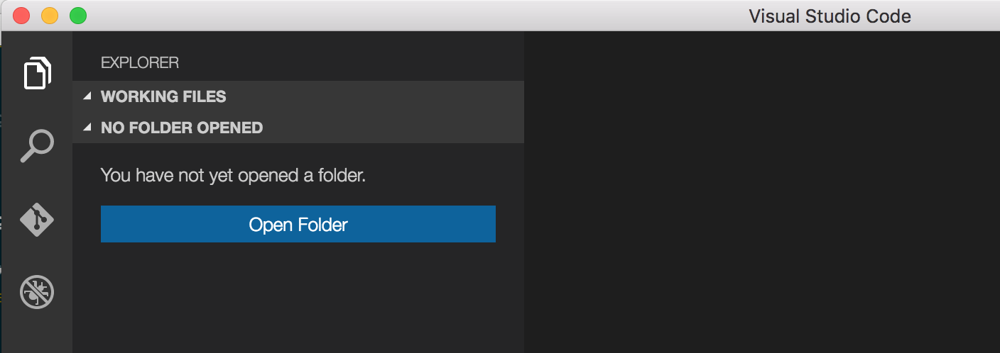
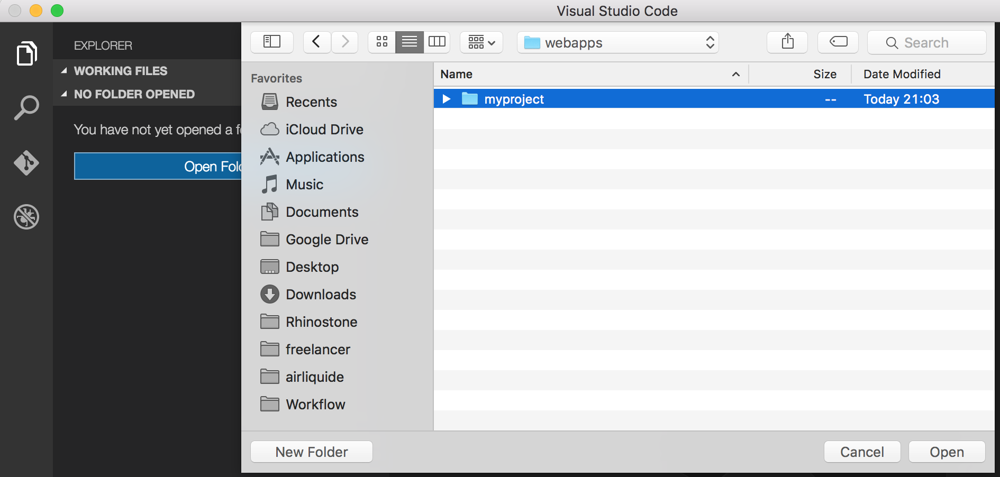
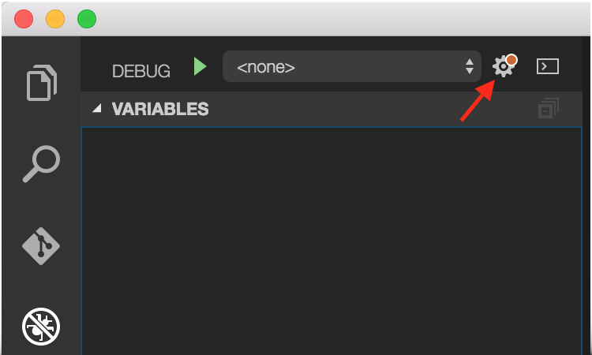
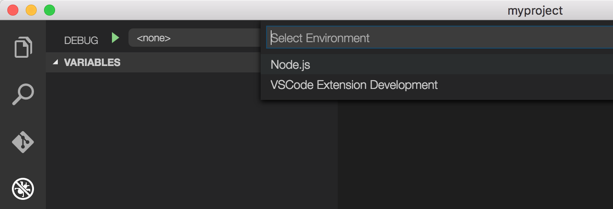
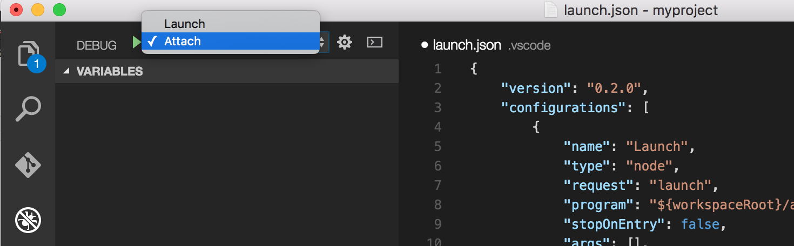
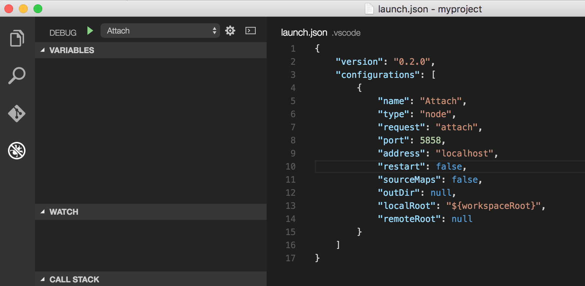
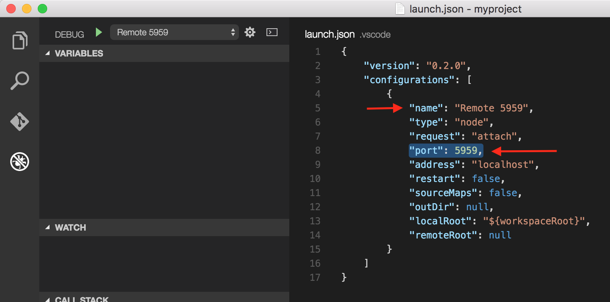
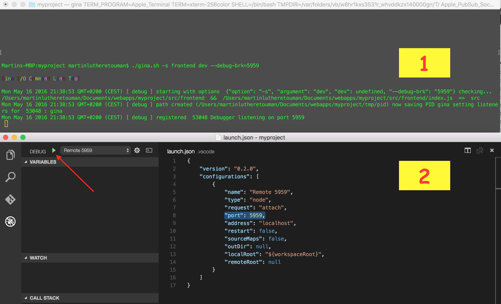
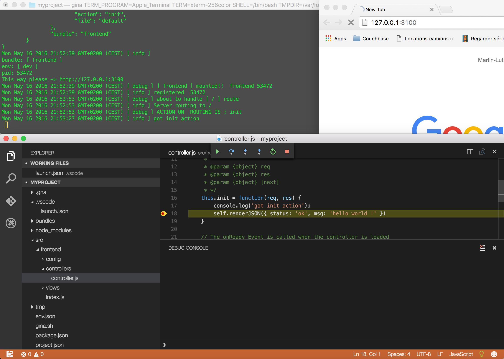

<div style="display:table; margin: 0; padding: 0">
	<span style="display:table-cell;">
    	
    </span>
    <span style="display:table-cell; padding: 0 10px; line-height:1.3em; font-style: italic;">
    	Gina was designed to be accessible, flexible, scalable and maintainable. Our main purpose was to allow developpers to create easier and faster web applications.

Gina comes with essential features at this moment, but most of the things we don't have yet can be replaced by some alternatives written in other languages like: Ruby, PHP, .net, Python or C++. You are free to use such alternatives until we implement similar features.
    </span>
</div>


__Gina is compatible with the following versions of Node.js:__
- `v7.x.x`,
- `v6.x.x` (Between Node.js 5.x and 6.3, NPM is broken, use manual installation: by cloning),
- `v5.x.x` (Between Node.js 5.x and 6.3, NPM is broken, use manual installation: by cloning),
- `v4.x.x`,
- `v0.12.x`, 
- `v0.11.x`,
- `v0.10.x`


## Getting started with Gina I/O

### Initializing a project
Let's create our first project and install gina.   
Type everything after the __`$`__

``` tty
$ mkdir myproject
```

``` tty
$ cd myproject
```

You can now install the framework using npm:

```  tty
$ npm install gina@latest
```
**OR by cloning (manual installation)**
```tty
$ mkdir node_modules
$ mkdir node_modules/gina
$ git clone https://github.com/Rhinostone/gina.git ./node_modules/gina
$ node ./node_modules/gina/script/post_install.js
```

Then you need to __initialize your project__

> On Mac Os X or on Linux

```  tty
$ ./gina.sh -i myproject
```

> on Windows from the Windows CLI - __NEED TO BE ADMIN !!__

```  tty
$ gina -i myproject
```


__NB:__ All gina commands are launched from the project root.

### Creating a bundle (application)

A project is a set of bundles. Gina lets you create all kind of bundles :
* api & webservices
* frontend & backend applications
* command lines

Note that the default bundle type is api.

Ok ! Let's do it !

``` tty
$ ./gina.sh -a frontend
```

We have just created a frontend application that will host our homepage.
You will find all bundle sources under `myproject/src`.

You can start the bundle with the following command:

```tty
$ ./gina.sh -s frontend dev
```
Now, visite http://127.0.0.1:3100/  to check your homepage.
Isn't it sexy !?

If you need to stop it, just hit `ctrl+c`.


### Adding views

The default bundle renders a json representation of a "Hello World" message.

Let's add views on our frontend

```tty
$ ./gina.sh -av frontend
```
Now edit the `init` action in `src/frontend/controllers/controller.js` so that you can have `self.render(...)` instead of `self.renderJSON(...)`

Once it's done, you just need to refresh your browser.

Gina is shipped with [Swig](http://paularmstrong.github.io/swig/docs/api/) as the default template engine. If you are more comfortable with another template engine, you can use your own.

## Debugging in Gina

You can attach a remote debuger like [Visual Studio Code](https://code.visualstudio.com/Download) to Gina.

1. Open your project   
   
   
2. Click to the `Debug` tab   
   
3. Open your configuration file and select `Node.js`   
   
   
4. Select `Attach` and clean your configuration   
   
   
5. Change the __port number__ to match the one you will be listening from Gina (e.g.: `5959`)   
   

6. Save, and go back to your terminal to start your bundle with the debug argument:
```tty 
$ ./gina.sh -s frontend dev --debug-brk=5959
```
> Gina will be waiting for you to launch the remote debugger.

7. Launch your remote debugger & have fun !   
   
	Debugger in action
       

## Troubleshooting

### I can't start my bundle

__Are you starting for the first time ?__

- If you are a __Windows user__, make sure you are running your command line with sufficient permission; like __"launching your terminal as administrator"__.


- If you have just cloned Gina from github, don't forget to run from the project root :
```tty
$ node node_modules/gina/script/post_install.js
```

- Have you noticed the __environment argument__ ( dev ) ?
``` tty
$ ./gina.sh -s frontend dev
```
Without the __dev__ argument, Gina is going to understand that you want to use the production environment. If it's really what you want to achieve, just __build__ :
```tty
$ ./gina.sh -b frontend prod
```
NB.: `prod` is optional here; if you don't add it, it will build for prod by default.


__Are you trying to restart after a crash ?__

Gina uses 2 processes today: one master, one slave (it will change very soon). Once an excepion is thrown and the program crashes, one of the 2 process can remain in the tasks/processes list.
This has been mostly observed for Windows users.

- If you are on a POSIX OS, you should look for `gina`, then kill it !

- If you are on a Windows, look for `node.exe` or  `Event I/O Handler`, then kill it !

After this, try again to start, it should run better.

### I can't re install Gina

__Are you trying to reinstall from the project root ?__

- Go to your project root (where you can see `env.json` & `project.json`)
- Remove the file `gina`. This bug is related to npm since node 0.12.x and only found on POSIX Operating Systems
``` tty
$ rm ./gina
```
- You can now reinstall
``` tty
$ npm install gina
```


More documentation and tutorials are coming !


## License (MIT)

Copyright (c) 2009-2016 [Rhinostone](http://www.rhinostone.com/)

Permission is hereby granted, free of charge, to any person obtaining a copy
of this software and associated documentation files (the "Software"), to deal
in the Software without restriction, including without limitation the rights
to use, copy, modify, merge, publish, distribute, sublicense, and/or sell
copies of the Software, and to permit persons to whom the Software is furnished
to do so, subject to the following conditions:

The above copyright notice and this permission notice shall be included in all
copies or substantial portions of the Software.

THE SOFTWARE IS PROVIDED "AS IS", WITHOUT WARRANTY OF ANY KIND, EXPRESS OR
IMPLIED, INCLUDING BUT NOT LIMITED TO THE WARRANTIES OF MERCHANTABILITY,
FITNESS FOR A PARTICULAR PURPOSE AND NONINFRINGEMENT. IN NO EVENT SHALL THE
AUTHORS OR COPYRIGHT HOLDERS BE LIABLE FOR ANY CLAIM, DAMAGES OR OTHER
LIABILITY, WHETHER IN AN ACTION OF CONTRACT, TORT OR OTHERWISE, ARISING FROM,
OUT OF OR IN CONNECTION WITH THE SOFTWARE OR THE USE OR OTHER DEALINGS IN
THE SOFTWARE.