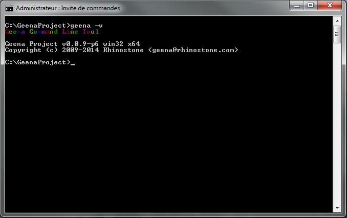
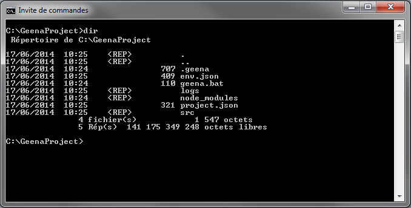
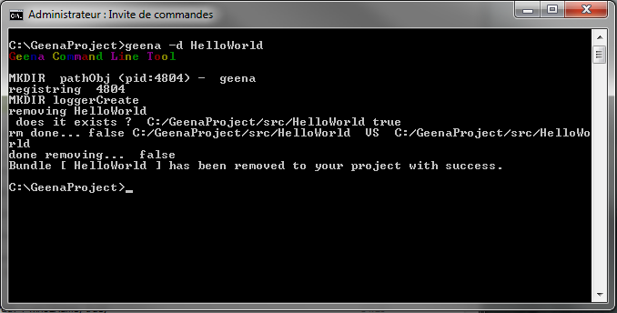
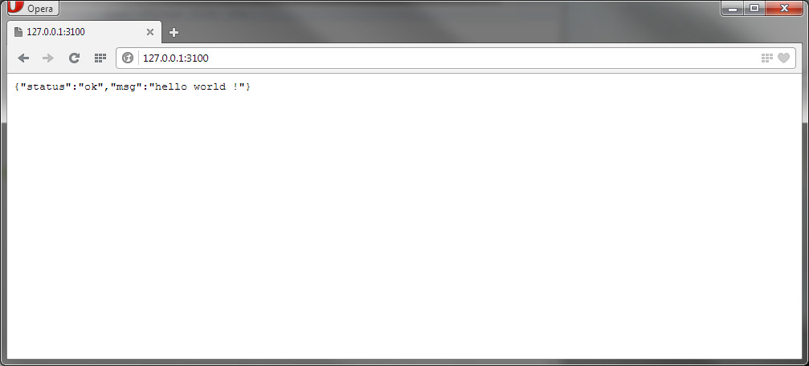

# GINA

* * *

## Requirement
- node.js
- etc

* * *

## Commands

/!\ To use GINA in command line, the terminal must have the administrator right. /!\

- help :
	`gina -h | --help`

- version :
	`gina -v | --version`

- init :
	`gina -i | --init <project_name>`

- build :
	`gina -b | --build [bundle name]`

- add :
	`gina -a | --add <bundle name> [arguments]`

- delete :
	`gina -d | --delete <bundle name>`

- restart :
	`gina -r | --restart <bundle name>`

- start :
	`gina -s | --start <bundle name> [mode] [options]`
	- dev :
		`gina -s <bundle name> dev`

Default IP (localhost), default port and default routes :

To close the process, ctrl+C :

	- prod :
		`gina -s <bundle name> prod`
	- staging :
		`gina -s <bundle name> ???`
	- debug :
		`gina -s <bundle name> <mode> --debug-brk=<port>`