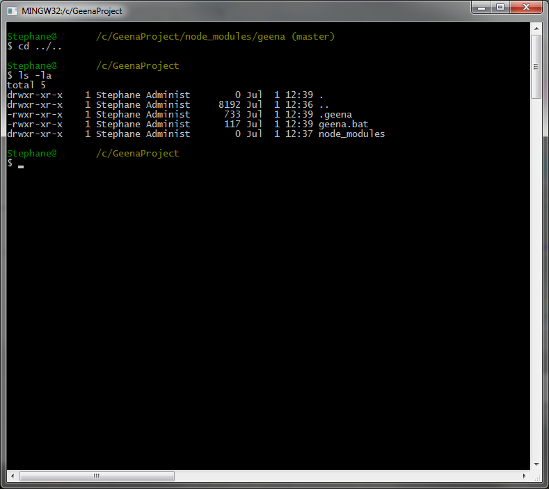

# GINA - Installation

* * *

## Requirement
- node.js
- etc

- - -

## NPM
1. Start by create and/or going in the project folder.
`mkdir <project name>`
`cd <project name>`

2. Then install GINA with NPM.
`npm install gina`

At the end of npm install, you will see this :

And for an empty folder, 3 new elements are created :

Congratulation, you have installed GINA.

- - -

## GIT
1. Start by create and/or going in the project folder.
`mkdir <project name>`
`mkdir <project name>/node_modules`
`cd <project name>/node_modules`

2. Then get GINA with GIT.
`git clone https://github.com/Rhinostone/gina.git`

3. Then start the post_install.js script to install Gina.
`cd gina`
`npm install`

At the end of npm install, you will see this :

After npm install, script/post_install.js will start and add 3 new elements at the project folder root :

Congratulation, you have installed GINA.