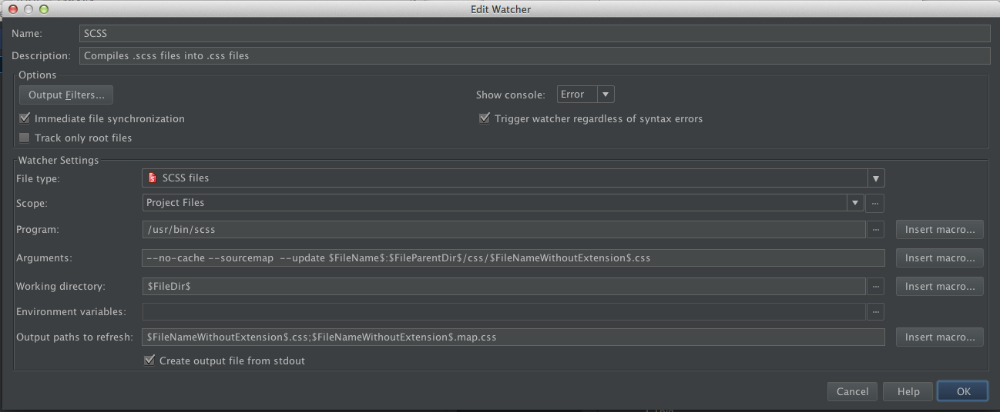
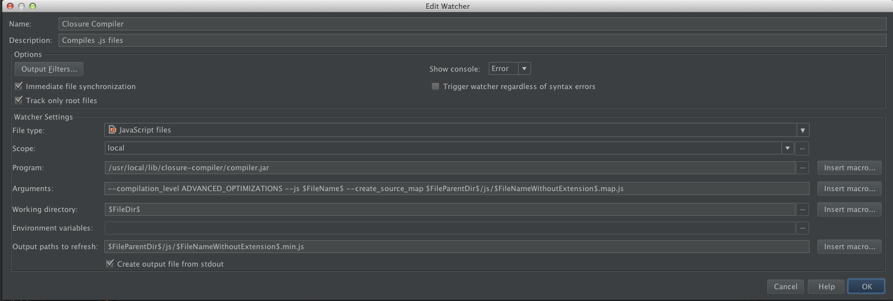

# README

## SCSS

1. Install SASS : `http://sass-lang.com/install`

2. Configure WebStorm :
	1. File > Settings > File Watcher
	2. Add ('+' button)
	3. Then filled like this screenshot :  
		  
		1. Program : Find the scss file
			Default for windows (RubyInstaller/SASS) : `C:\Ruby193\bin\scss`
		2. Arguments : `--no-cache --sourcemap --update $FileName$:$FileParentDir$/css/$FileNameWithoutExtension$.css`
		3. Ouput paths to refresh : `$FileNameWithoutExtension$.css;$FileNameWithoutExtension$.map.css`

## Closure Compiler

1. Get Closure compiler (.jar)

2. Configure WebStorm :
	1. File > Settings > File Watcher
	2. Add ('+' button)
	3. Then filled like this screenshot :  
		
		1. Program : Put the path to closure compile jar
		2. Scope : Choice the rights scope/files. By default, closure will compile all js files from the project root.
		3. Arguments : `--compilation_level SIMPLE_OPTIMIZATIONS --js $FileName$ --create_source_map $FileParentDir$/js/$FileNameWithoutExtension$.js.map`
		4. Ouput paths to refresh : `$FileParentDir$/js/$FileNameWithoutExtension$.min.js`