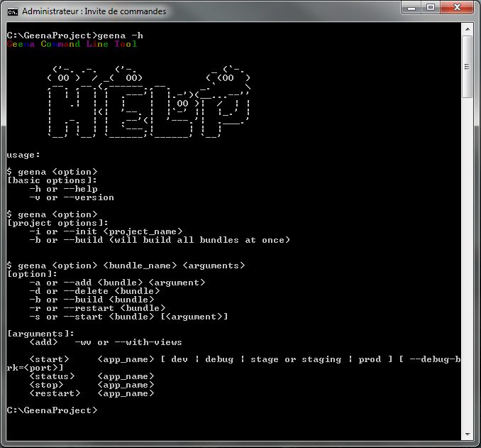
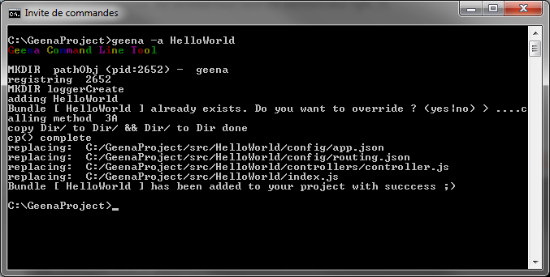
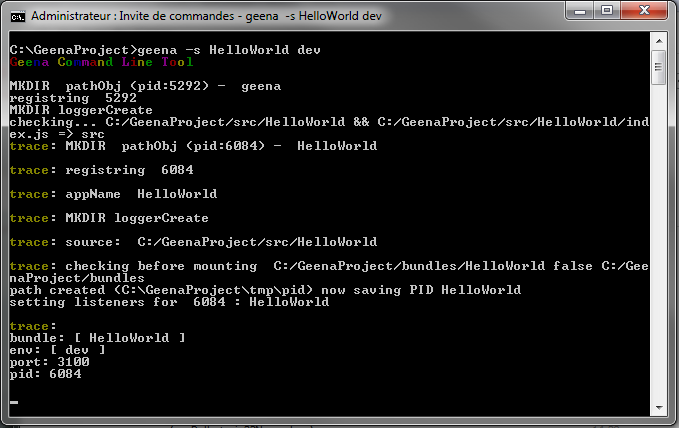
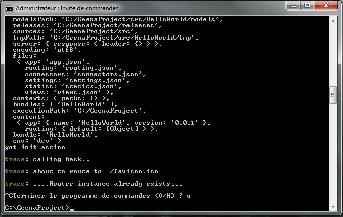

# GEENA

* * *

## Requirement
- node.js
- etc

* * *

## Commands

/!\ To use GEENA in command line, the terminal must have the administrator right. /!\

- help :  
	`geena -h | --help`

- version :  
	`geena -v | --version`

- init :  
	`geena -i | --init <project_name>`

- build :  
	`geena -b | --build [bundle name]`

- add :  
	`geena -a | --add <bundle name> [arguments]`

- delete :  
	`geena -d | --delete <bundle name>`

- restart :  
	`geena -r | --restart <bundle name>`

- start :  
	`geena -s | --start <bundle name> [mode] [options]`
	- dev :  
		`geena -s <bundle name> dev`

Default IP (localhost), default port and default routes :

To close the process, ctrl+C :

	- prod :  
		`geena -s <bundle name> prod`
	- staging :  
		`geena -s <bundle name> ???`
	- debug :  
		`geena -s <bundle name> <mode> --debug-brk=<port>`