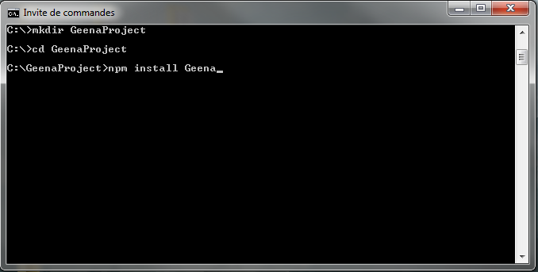
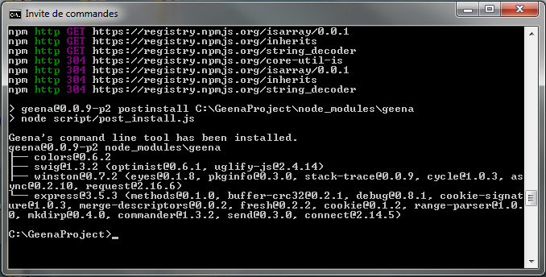
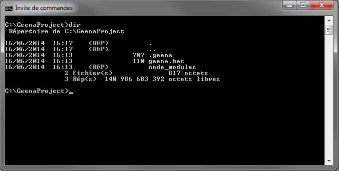

# GEENA

* * *

## Requirement
- node.js
- etc

- - -

## Install

1. Start by create and/or going in the project folder.  
`mkdir <project name>`  
`cd <project name>`

2. Then install GEENA with NPM.  
`npm install geena`

At the end of npm install, you will see this :  

And for an empty folder, 3 new elements are created :  

Congratulation, you have installed GEENA.