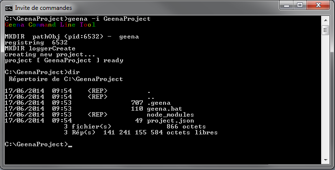

# GEENA

* * *

## Introduction

- - -

## Requirement
- node.js
- etc

- - -

### philosophy
- Choice
- Use

- - -

## Install

1. Start by create and/or going in the project folder.  
`mkdir <project name>`  
`cd <project name>`

2. Then install GEENA with NPM.  
`npm install geena`

At the end of npm install, you will see this :  

And for an empty folder, 3 new elements are created :  

Congratulation, you have installed GEENA.

* * *

## Commands

/!\ To use GEENA in command line, the terminal must have the administrator right. /!\

- help :  
	`geena -h | --help`

- version :  
	`geena -v | --version`

- init :  
	`geena -i | --init <project_name>`

- build :  
	`geena -b | --build [bundle name]`

- add :  
	`geena -a | --add <bundle name> [arguments]`

- delete :  
	`geena -d | --delete <bundle name>`

- restart :  
	`geena -r | --restart <bundle name>`

- start :  
	`geena -s | --start <bundle name> [mode] [options]`
	- dev :  
		`geena -s <bundle name> dev`
	- prod :  
		`geena -s <bundle name> prod`
	- staging :  
		`geena -s <bundle name> ???`
	- debug :  
		`geena -s <bundle name> <mode> --debug-brk=<port>`

* * *

## Project
- project/structure
	- bundles
	- logs
	- node_modules
	- releases
	- src
	- tmp
- env.json
	- configuration/use
- project.json
- bundles

* * *

## service
- routing
- controller
- index.js

* * *

## Views
- Templating
	- Swig
	- include
- config
	- aliases
	- controller/render

* * *

## Models
- init
	- index.js
	- config/connectors.json
	- models/___/lib/connector.js
- use
	- entities
	- controller.js

* * *

## Error

- geena start and end without error
	- administrator
	- bundle/port already working
	- model : database

* * *

## Tutorial
### Hello world